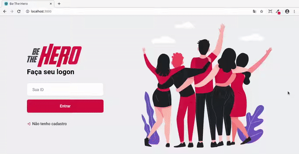

  

Este projeto foi desenvolvido durante a Semana Omnistack <strong style="color:#E02343"> 11.0</strong> :rocket:

## :rocket: Tecnologias
O projeto foi desenvolvido utilizando as seguintes tecnologias:
<ul style="list-style:">
    <strong><li>ReactJS </li>
    <li>NodeJS </li></strong>
</ul>

## 💻 Projeto
Este projeto visa construir uma rede de solidariedade entre pessoas dispostar a ajudar e ONG's que estejam necessitando desta ajuda. 

## :octocat: Overview

